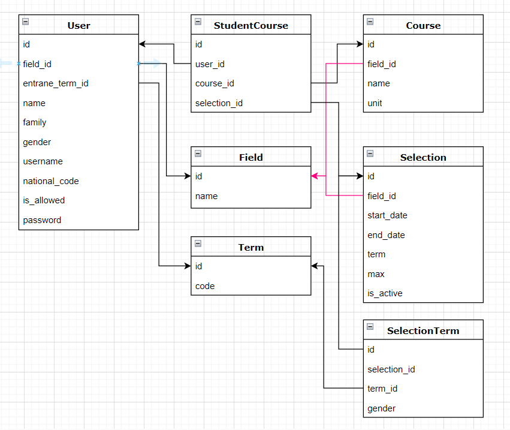

## Pre-registration system for Qom University students

[Introduction of the system by Qom University's CE Scientific Society](https://t.me/Ceqom/1133)

In this system, students Take their desired courses from among the specified courses, and department managers design the semester program (courses offered, overlap of courses, timing) based on students' choices using various reports. (Member of Qom University Academic Movement Festival exhibition as a student achievement)

